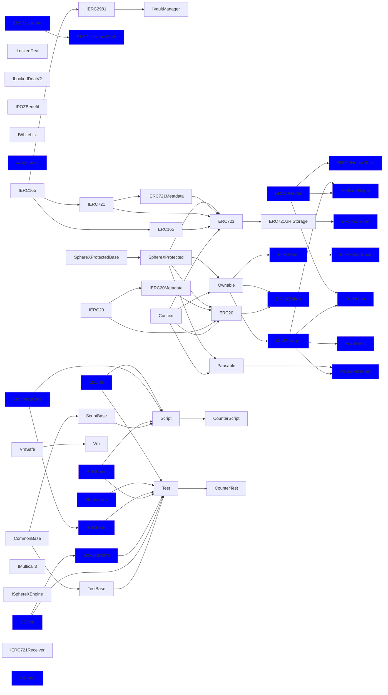

```mermaid
flowchart LR
ERC20Helper_bace6feed17ac0ad9581e68796b08912[ERC20Helper]:::changed

ERC721Helper_cce308b3f321c39317dcbb34e5bbc06a[ERC721Helper]:::changed

ETHHelper_018e3347256df26018ed09a0aaae8136[ETHHelper]:::changed
Ownable_3857ac9af9bd40ddd26203f20a422ab2 --> ETHHelper_018e3347256df26018ed09a0aaae8136

FeeBaseHelper_3c70dc0a8784c830b3ba1b90f60fa438[FeeBaseHelper]:::changed
ERC20Helper_bace6feed17ac0ad9581e68796b08912 --> FeeBaseHelper_3c70dc0a8784c830b3ba1b90f60fa438
GovManager_2cd5db60729a448bc9f67a137cba8cf1 --> FeeBaseHelper_3c70dc0a8784c830b3ba1b90f60fa438

GovManager_2cd5db60729a448bc9f67a137cba8cf1[GovManager]:::changed
Ownable_3857ac9af9bd40ddd26203f20a422ab2 --> GovManager_2cd5db60729a448bc9f67a137cba8cf1

PausableHelper_48e2ac9a8bc9a1be0f6f8b41d16e6ae6[PausableHelper]:::changed
GovManager_2cd5db60729a448bc9f67a137cba8cf1 --> PausableHelper_48e2ac9a8bc9a1be0f6f8b41d16e6ae6
Pausable_61067327731a67c41ea589e66f593aca --> PausableHelper_48e2ac9a8bc9a1be0f6f8b41d16e6ae6

PozBenefit_9dd71724aa9148380315464b4331f8ad[PozBenefit]:::changed
GovManager_2cd5db60729a448bc9f67a137cba8cf1 --> PozBenefit_9dd71724aa9148380315464b4331f8ad

ILockedDeal_6368d7301e7bb9665e866062e448e278[ILockedDeal]

ILockedDealV2_024e2367af21a12ddb879a1d110843bf[ILockedDealV2]

IPOZBenefit_c30ed3bdc2d123699669d5fa22773d3d[IPOZBenefit]

IVaultManager_eea2fd9f5581799a3ecc204c72858770[IVaultManager]
IERC2981_44928dc97c63780edd7c131dc244d569 --> IVaultManager_eea2fd9f5581799a3ecc204c72858770

IWhiteList_377605740d59cec19c7cbf699e8bfd5b[IWhiteList]

ArraysMock_faecb974d89cd40c6cae515da9755311[ArraysMock]:::changed

ERC20HelperMock_e3838d8a4ef41f513ee356a6de7daffd[ERC20HelperMock]:::changed
ERC20Helper_bace6feed17ac0ad9581e68796b08912 --> ERC20HelperMock_e3838d8a4ef41f513ee356a6de7daffd

ERC721HelperMock_fb866a8d9c59a6913490dea929c37a97[ERC721HelperMock]:::changed
ERC721Helper_cce308b3f321c39317dcbb34e5bbc06a --> ERC721HelperMock_fb866a8d9c59a6913490dea929c37a97

ETHHelperMock_f239c7e550b40f0ab6bc04f20c50619d[ETHHelperMock]:::changed
ETHHelper_018e3347256df26018ed09a0aaae8136 --> ETHHelperMock_f239c7e550b40f0ab6bc04f20c50619d

FeeHelper_819d4c2b29d41f497b1f47766aa38646[FeeHelper]:::changed
GovManager_2cd5db60729a448bc9f67a137cba8cf1 --> FeeHelper_819d4c2b29d41f497b1f47766aa38646
ERC20Helper_bace6feed17ac0ad9581e68796b08912 --> FeeHelper_819d4c2b29d41f497b1f47766aa38646

ERC20Token_c9142453b611ffe2ac7ab2bc4f804f29[ERC20Token]:::changed
ERC20_74a6337a07dfd01fd04cab263d3e1c8e --> ERC20Token_c9142453b611ffe2ac7ab2bc4f804f29
Ownable_3857ac9af9bd40ddd26203f20a422ab2 --> ERC20Token_c9142453b611ffe2ac7ab2bc4f804f29

ERC721Token_27beaa9eb23d69f1b628e31f1b671d83[ERC721Token]:::changed
ERC721URIStorage_98ead179e350c46152883c7003c7f0a1 --> ERC721Token_27beaa9eb23d69f1b628e31f1b671d83

DSTest_c3c08b78d0753b6210745aae224e1b0c[DSTest]:::changed

CommonBase_284f178f4e835e02863eade9ac3f9e69[CommonBase]

TestBase_284f178f4e835e02863eade9ac3f9e69[TestBase]
CommonBase_284f178f4e835e02863eade9ac3f9e69 --> TestBase_284f178f4e835e02863eade9ac3f9e69

ScriptBase_284f178f4e835e02863eade9ac3f9e69[ScriptBase]
CommonBase_284f178f4e835e02863eade9ac3f9e69 --> ScriptBase_284f178f4e835e02863eade9ac3f9e69

Script_ee14cda94b78278c0e05d04d8ee17973[Script]
ScriptBase_284f178f4e835e02863eade9ac3f9e69 --> Script_ee14cda94b78278c0e05d04d8ee17973
StdChains_52a27a9d543e9e103be9308530058c4e --> Script_ee14cda94b78278c0e05d04d8ee17973
StdCheatsSafe_b40cf506ca8678bee66e719279afd98c --> Script_ee14cda94b78278c0e05d04d8ee17973
StdUtils_6ee804b6095129b5836f7e124f4e151c --> Script_ee14cda94b78278c0e05d04d8ee17973

StdAssertions_200c03532eb19097f2b286aae4aa46ab[StdAssertions]:::changed
DSTest_c3c08b78d0753b6210745aae224e1b0c --> StdAssertions_200c03532eb19097f2b286aae4aa46ab

StdChains_52a27a9d543e9e103be9308530058c4e[StdChains]:::changed

StdCheatsSafe_b40cf506ca8678bee66e719279afd98c[StdCheatsSafe]:::changed

StdCheats_b40cf506ca8678bee66e719279afd98c[StdCheats]:::changed
StdCheatsSafe_b40cf506ca8678bee66e719279afd98c --> StdCheats_b40cf506ca8678bee66e719279afd98c

StdInvariant_9e9a206284a8934c5d9fc821641d5120[StdInvariant]:::changed

StdUtils_6ee804b6095129b5836f7e124f4e151c[StdUtils]:::changed

Test_0e34c664ff8facc208bf5075397463fc[Test]
TestBase_284f178f4e835e02863eade9ac3f9e69 --> Test_0e34c664ff8facc208bf5075397463fc
DSTest_c3c08b78d0753b6210745aae224e1b0c --> Test_0e34c664ff8facc208bf5075397463fc
StdAssertions_200c03532eb19097f2b286aae4aa46ab --> Test_0e34c664ff8facc208bf5075397463fc
StdChains_52a27a9d543e9e103be9308530058c4e --> Test_0e34c664ff8facc208bf5075397463fc
StdCheats_b40cf506ca8678bee66e719279afd98c --> Test_0e34c664ff8facc208bf5075397463fc
StdInvariant_9e9a206284a8934c5d9fc821641d5120 --> Test_0e34c664ff8facc208bf5075397463fc
StdUtils_6ee804b6095129b5836f7e124f4e151c --> Test_0e34c664ff8facc208bf5075397463fc

VmSafe_92fd83d0477a84d01c8a5c61b05c2521[VmSafe]

Vm_92fd83d0477a84d01c8a5c61b05c2521[Vm]
VmSafe_92fd83d0477a84d01c8a5c61b05c2521 --> Vm_92fd83d0477a84d01c8a5c61b05c2521

IMulticall3_40f9810fe8573454077a68ced628ff68[IMulticall3]

ISphereXEngine_74622476e281b907d85bc2d241106228[ISphereXEngine]

SphereXProtected_8c2fcb07830a5b5d1bfa11de40ce896e[SphereXProtected]
SphereXProtectedBase_406bf73154e9cdf743ab981ce7029977 --> SphereXProtected_8c2fcb07830a5b5d1bfa11de40ce896e

SphereXProtectedBase_406bf73154e9cdf743ab981ce7029977[SphereXProtectedBase]

Ownable_3857ac9af9bd40ddd26203f20a422ab2[Ownable]
Context_07d9407359f1aabebffee07c718dfc60 --> Ownable_3857ac9af9bd40ddd26203f20a422ab2
SphereXProtected_8c2fcb07830a5b5d1bfa11de40ce896e --> Ownable_3857ac9af9bd40ddd26203f20a422ab2

IERC2981_44928dc97c63780edd7c131dc244d569[IERC2981]
IERC165_bbbc220895ac93c044dfd72f0cdee365 --> IERC2981_44928dc97c63780edd7c131dc244d569

Pausable_61067327731a67c41ea589e66f593aca[Pausable]
Context_07d9407359f1aabebffee07c718dfc60 --> Pausable_61067327731a67c41ea589e66f593aca
SphereXProtected_8c2fcb07830a5b5d1bfa11de40ce896e --> Pausable_61067327731a67c41ea589e66f593aca

ERC20_74a6337a07dfd01fd04cab263d3e1c8e[ERC20]
Context_07d9407359f1aabebffee07c718dfc60 --> ERC20_74a6337a07dfd01fd04cab263d3e1c8e
IERC20_5a89c49332cd26511ce078c260b03e94 --> ERC20_74a6337a07dfd01fd04cab263d3e1c8e
IERC20Metadata_56e53815b0dcf633f8701a488374ff08 --> ERC20_74a6337a07dfd01fd04cab263d3e1c8e
SphereXProtected_8c2fcb07830a5b5d1bfa11de40ce896e --> ERC20_74a6337a07dfd01fd04cab263d3e1c8e

IERC20_5a89c49332cd26511ce078c260b03e94[IERC20]

IERC20Metadata_56e53815b0dcf633f8701a488374ff08[IERC20Metadata]
IERC20_5a89c49332cd26511ce078c260b03e94 --> IERC20Metadata_56e53815b0dcf633f8701a488374ff08

ERC721_cfc45994ab91cdb6a6329b37a1f4599d[ERC721]
Context_07d9407359f1aabebffee07c718dfc60 --> ERC721_cfc45994ab91cdb6a6329b37a1f4599d
ERC165_a1e86fd36e630c8968eb1f3ae3e9a410 --> ERC721_cfc45994ab91cdb6a6329b37a1f4599d
IERC721_58c033f12b38bd99903ec3f2785077cb --> ERC721_cfc45994ab91cdb6a6329b37a1f4599d
IERC721Metadata_6cc7a7d98e30741264df2fa44a4c8b09 --> ERC721_cfc45994ab91cdb6a6329b37a1f4599d
SphereXProtected_8c2fcb07830a5b5d1bfa11de40ce896e --> ERC721_cfc45994ab91cdb6a6329b37a1f4599d

IERC721_58c033f12b38bd99903ec3f2785077cb[IERC721]
IERC165_bbbc220895ac93c044dfd72f0cdee365 --> IERC721_58c033f12b38bd99903ec3f2785077cb

IERC721Receiver_6b5c1a06a547e7eab9eaee4d4769286d[IERC721Receiver]

ERC721URIStorage_98ead179e350c46152883c7003c7f0a1[ERC721URIStorage]
ERC721_cfc45994ab91cdb6a6329b37a1f4599d --> ERC721URIStorage_98ead179e350c46152883c7003c7f0a1

IERC721Metadata_6cc7a7d98e30741264df2fa44a4c8b09[IERC721Metadata]
IERC721_58c033f12b38bd99903ec3f2785077cb --> IERC721Metadata_6cc7a7d98e30741264df2fa44a4c8b09

Context_07d9407359f1aabebffee07c718dfc60[Context]

ERC165_a1e86fd36e630c8968eb1f3ae3e9a410[ERC165]
IERC165_bbbc220895ac93c044dfd72f0cdee365 --> ERC165_a1e86fd36e630c8968eb1f3ae3e9a410

IERC165_bbbc220895ac93c044dfd72f0cdee365[IERC165]

CounterScript_a764b21bf9636701944c20aba9aba336[CounterScript]
Script_ee14cda94b78278c0e05d04d8ee17973 --> CounterScript_a764b21bf9636701944c20aba9aba336

Counter_a7d04152bfae411c1d5e095f44ad3fd1[Counter]:::changed

CounterTest_e03292376b6b4cb15c490e531b680166[CounterTest]
Test_0e34c664ff8facc208bf5075397463fc --> CounterTest_e03292376b6b4cb15c490e531b680166

classDef changed fill:blue
```
